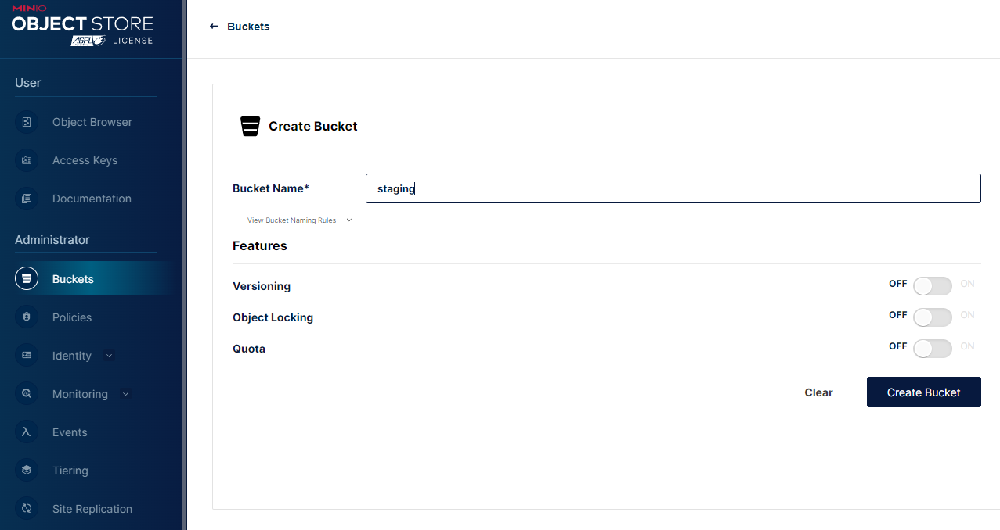
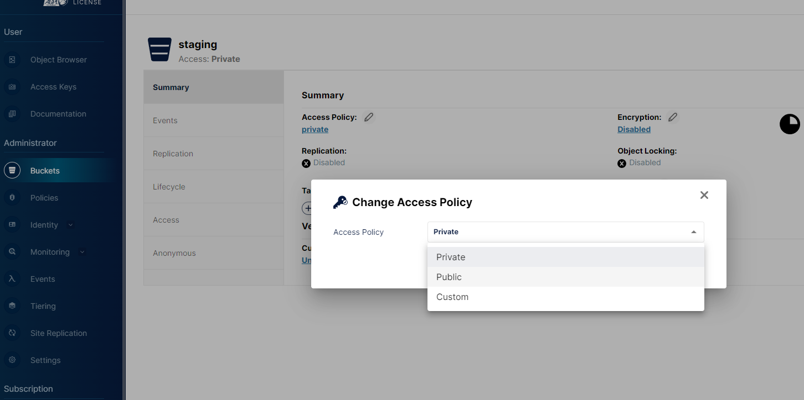
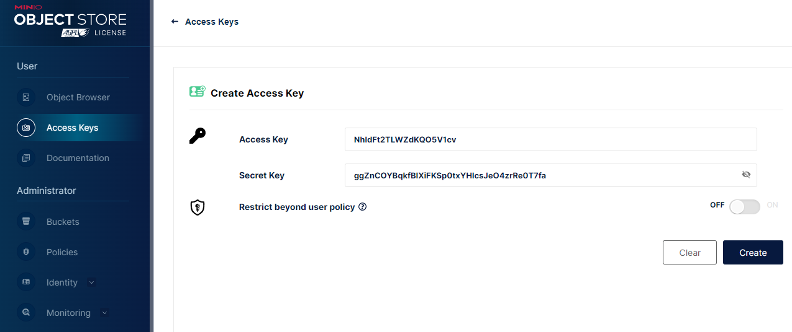

# ticketing-backend

## Development Setup

1. Install dependencies
   `yarn` or `npm install`
2. Setup the directory
   `./setup.sh`
3. Start the docker (other services)
   `yarn docker:up` or `npm run docker:up`
4. Create `staging` bucket on minio
   
5. Adjust bucket policy to public
    
6. Create and retrieve Access Key and Secret Key from minio dashboard
   
7. Run the backend server
   `yarn dev`